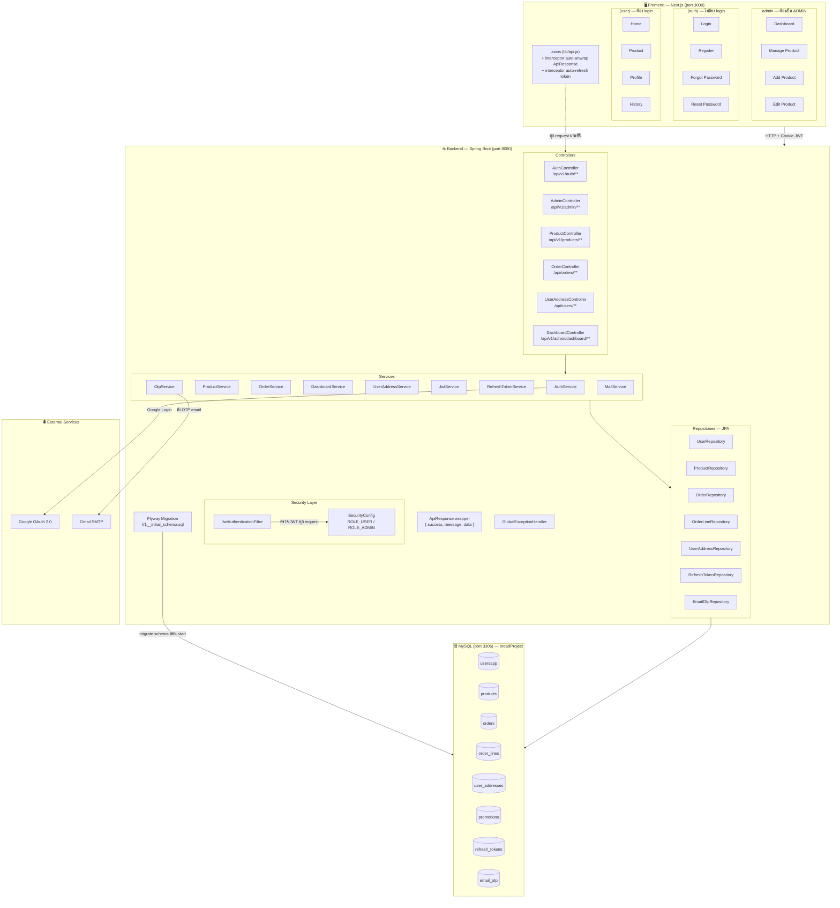
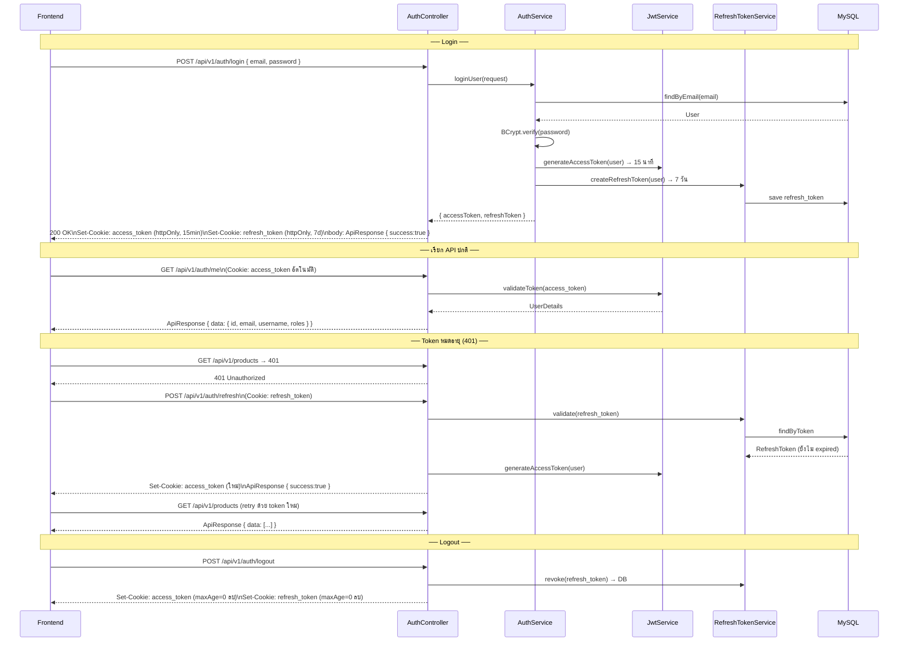
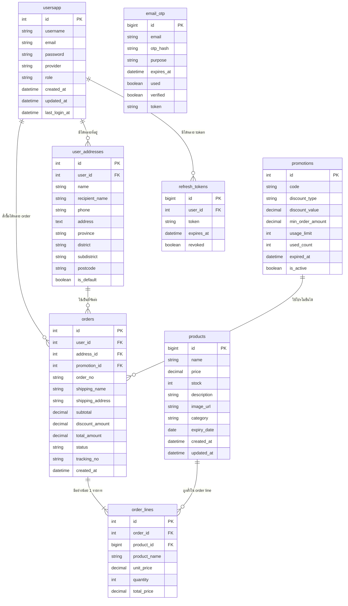
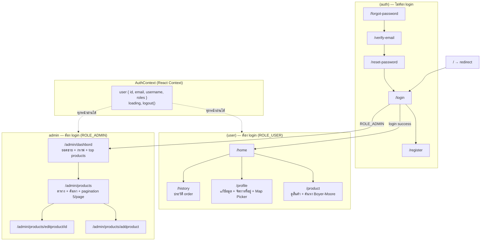

# BreadShop XXI — Project Diagram

---

## 1. System Overview (ภาพรวมทั้งระบบ)



---

## 2. Authentication Flow (การ Login)



---

## 3. Request Flow (ทุก request วิ่งผ่านอะไรบ้าง)

```mermaid
flowchart TD
    A([Browser]) -->|HTTP Request + Cookie| B

    subgraph FILTER["Security Filter Chain"]
        B[JwtAuthenticationFilter\nดึง access_token จาก Cookie]
        B -->|valid token| C[SecurityContext\nเก็บ UserDetails ไว้]
        B -->|ไม่มี token / expired| D[401 Unauthorized]
    end

    C --> E

    subgraph LAYER["Spring MVC Layers"]
        E[Controller\nรับ request, ส่ง response\nห้ามมี logic ที่นี่]
        E --> F[Service\nlogic ทางธุรกิจ\nvalidation, calculation]
        F --> G[Repository\nJPA query ไปที่ DB]
        G --> H[(MySQL)]
        G -->|Entity| F
        F -->|DTO| E
        E -->|ApiResponse wraps DTO| I[Response]
    end

    subgraph ERR["Error Handling"]
        J[GlobalExceptionHandler\n@RestControllerAdvice]
    end

    D --> ERR
    F -->|throw Exception| ERR
    ERR -->|ApiResponse.error| I

    I -->|JSON| A
```

---

## 4. Database Schema (ความสัมพันธ์ตาราง)



---

## 5. Frontend Page Structure (โครงสร้างหน้าเว็บ)


